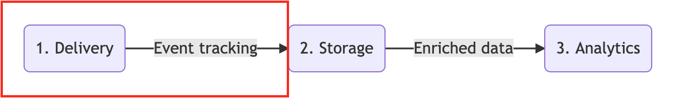

# Mojito JS Delivery

<p align="center">
A lightweight (&lt;5kb) JS framework for building, publishing and tracking experiments on the web. </p>

<p align="center">
Commonly known as A/B split testing, experimentation is a core pillar of Conversion Rate Optimisation.
</p>


<p align="center"></p>

## Prerequisites

- [npm](https://www.npmjs.com/)

## Getting setup

1. Fork this repository on GitHub
2. Clone your forked repository (not this original one) to your local environment
3. Install the necessary NPM packages: ```npm install```

## Creating and launching experiments

Get up and running with Mojito experiments in 4 steps:

1. [Experiment setup](#step-1-experiment-setup)
2. [Customisation and tracking](#step-2-customisation-and-tracking)
3. [Build container, preview and launch](#step-3-build-container-preview-and-launch)
4. [Hosting and publishing](#step-4-hosting-and-publishing)

### Step 1. Experiment setup

Learn about different approaches to setup experiments with Mojito. Get to know and understand important experiment parameters.

[Read about experiment setup.](./docs/setup.md)

### Step 2. Customisation and tracking

Set up custom tracking, error handling & user exclusion rules for your entire container.

[Read about customisation and tracking.](./docs/customisation.md)

### Step 3. Build container, preview and launch

Use Gulp to build the Mojito container and see how to preview and launch experiments.

[Read about the build, preview and launch process.](./docs/preview_launch.md)

### Step 4. Hosting and publishing

Host your container and automate the publishing process using CI.

[Read about hosting & publishing via AWS & Bitbucket](./docs/hosting.md)

## Experiment data and analysis

Data storage and analysis are contained in separate Mojito modules which can be customised and/or switched out as needed.

1. **Storage**: Data collection modules and data modelling steps to power your reports. e.g. [Mojito Snowplow Storage](https://github.com/mint-metrics/mojito-snowplow-storage)
2. **Analytics**: Tools to measure & report on the effects caused by your treatments. e.g. [Mojito R Analytics](https://github.com/mint-metrics/mojito-r-analytics)

## Get involved

Let us know if you encounter any issues and reach out to us if you need a hand getting set up.

* [Open an issue on Github](https://github.com/mint-metrics/mojito-js-delivery/issues/new)
* [Mint Metrics' website](https://mintmetrics.io/)
