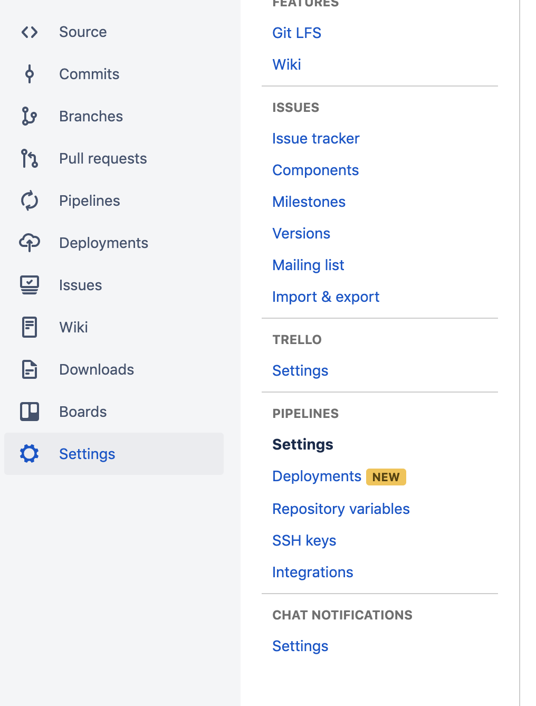
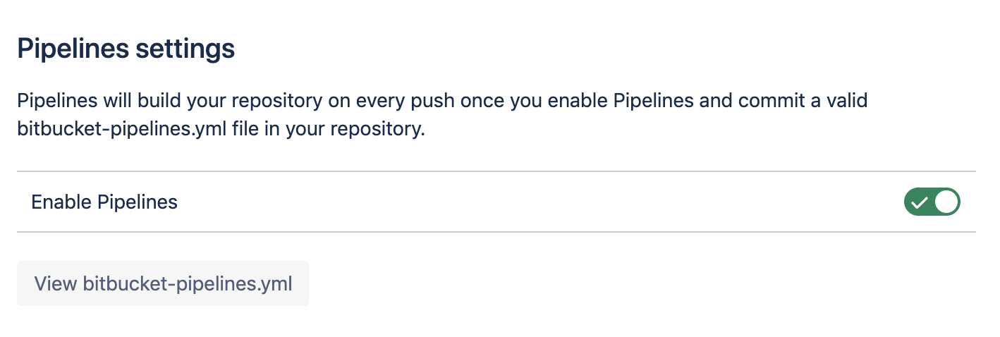
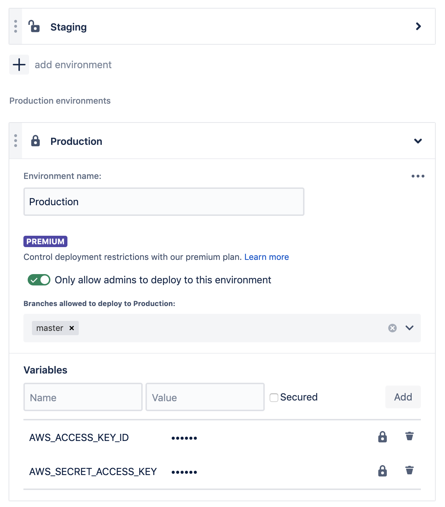

# Setting up Bitbucket Pipelines for Mojito

If using Bitbucket, with Pipelines build minutes, you can build, test and publish Mojito JS from the cloud. Perfect for managing your deployments and tracking what's running in production.

## Enable Bitbucket Pipelines in your repo

Open your Mojito JS repo on Bitbucket, browse to `Settings` and open your Pipelines' `Settings`:

Flick the switch to turn on Pipelines:

## Add your Mojito user's AWS credentials to the desired Bitbucket environments

Each deployment environment can have different credentials. This is perfect if you want to restrict publish access to Admin users.

Inside your repo settings, browse to `Deployments` under the `Pipelines` section:

Now, add credentials to your `staging` and `production` environments - and **designate the credentials `Secured`**:

 - `AWS_ACCESS_KEY_ID`: Mojito user's AWS Key
 - `AWS_SECRET_ACCESS_KEY`: Mojito user's AWS Secret

Here's where you can restrict publishing to production from specific branches (e.g. like `master`) or only by `Admin` users on your Bitbucket team, too.

## Next steps

Now you're ready to install your snippet.

 * [Back to hosting](../hosting.md)
 * [Back to home](../../README.md)

