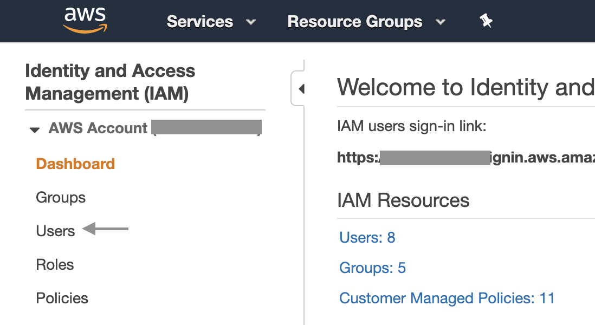
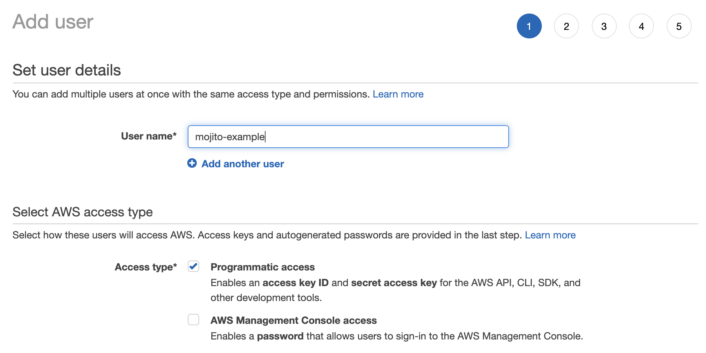
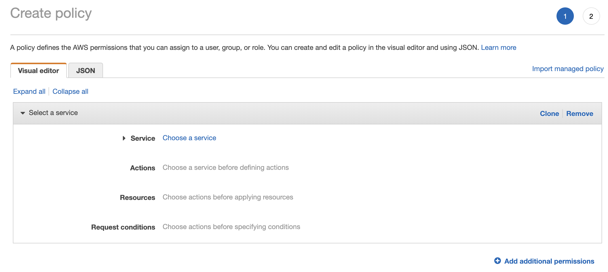
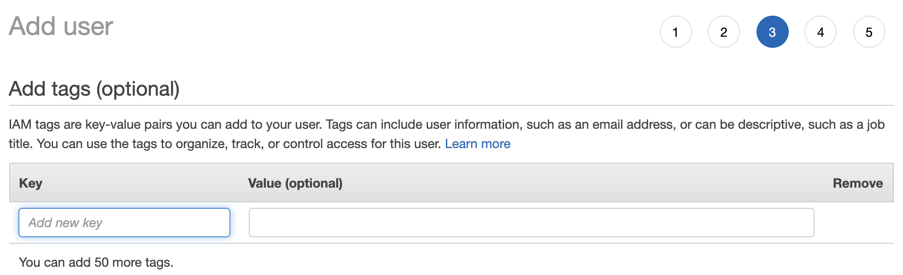
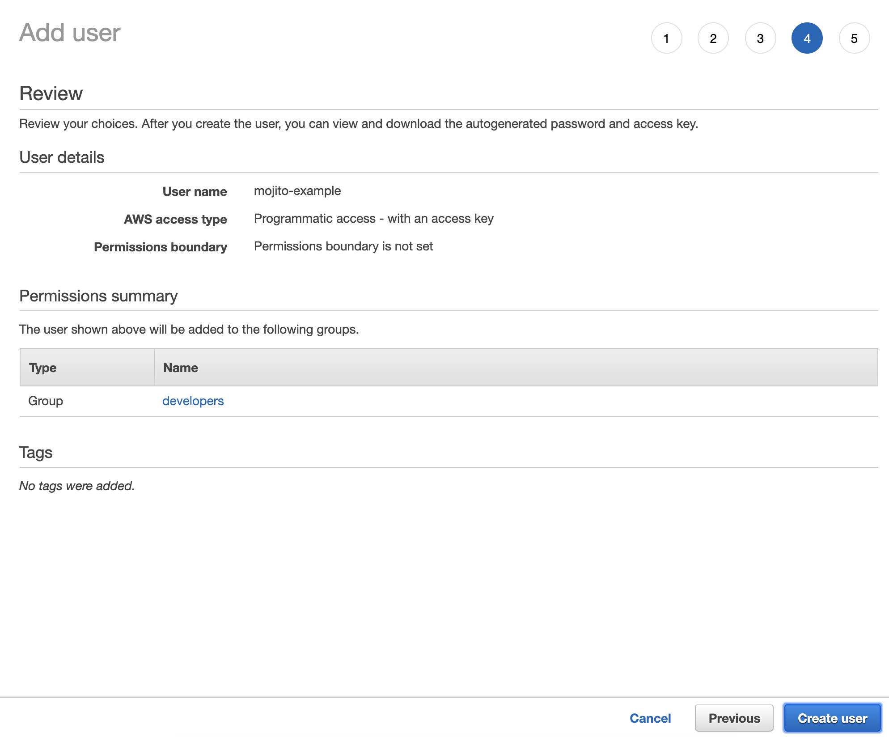
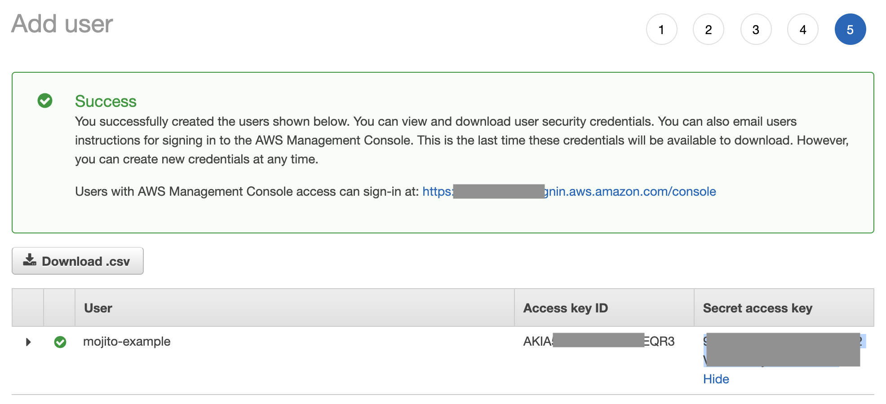

# Create a user with limited credentials for publishing to S3 & Cloudfront

We'll use this account to publish Mojito JS containers from your IDE and/or CI pipeline. It's a good practice to lock down the permissions on these users to the specific files/folders they need.

Before you continue - [Haven't got a Cloudfront distribution & S3 container setup? Check out the guide here.](s3_cf.md)

## Create an account in Amazon IAM

1. Log in to [Amazon IAM](https://console.aws.amazon.com/iam/home) and go to the users section:



2. Now hit the big blue `Create User` button to open the dialog to add a new user. Assign them a descriptive username and give them `Programmatic access`:



3. Continue to the user's permissions and assign them to a group with the appropriately locked down `Policy`: 


If you don't have one yet, we suggest [creating a policy through IAM's visual editor](https://console.aws.amazon.com/iam/home#/policies$new?step=edit).

We ensure users are locked down to the specific resources they require:

```json
...
    "Resource": [
        "arn:aws:s3:::mojito-example/js/container-name.js",
        "arn:aws:s3:::mojito-example/jsdev/container-name*",
        "arn:aws:s3:::mojito-example"
    ]
...
```

This ensures access to your other S3 buckets and containers' environments are locked down tightly. Meanwhile, wildcards come in handy for publishing `container-name.pretty.js` or setting up other blanket policies.

[](https://console.aws.amazon.com/iam/home#/policies$new?step=edit)


4. (Optional) Add tags to the user if you need them, or skip to the next step



5. Review the user's settings and if all is OK, hit `Create user`.



6. Take note of the user's Access Key ID and Secret - these are the credentials Mojito's build script will use to publish to AWS from your IDE or Bitbucket Pipeline.




## Install and set up the AWS CLI tool (to allow publishing via the CLI)

Follow [Amazon's AWS CLI installation & setup guide](https://docs.aws.amazon.com/cli/latest/userguide/cli-chap-install.html) using the credentials you created in Step #1. We won't cover this here.

Now you can publish straight from your IDE:

```bash
gulp scripts && gulp publish
```

And if your user has access to production, they can push to your configured production environment through the `--production` flag:

```bash
gulp scripts && gulp publish --production
```

## Repeat this step for other users

We suggest adding the following users:

 - Bitbucket production environments
 - Bitbucket development environments
 - Individual developers who need to publish to specific environments from their IDEs

For easy maintenance, use roles and groups that have your Mojito policies attached.

## Next steps

Continue to [set up Bitbucket Pipelines for Continuous Integration from a Web UI](./bitbucket.md).

Or if you're publishing via the CLI, you may want to [install Mojito JS into your site](./snippet.md).
