# Setting up AWS S3 & a Cloudfront distribution to serve Mojito JS from

We set up S3 and Cloudfront first so we can assign users with limited access to publish conatiners.

## Create a public S3 Bucket

A public S3 bucket is useful for preview/staging purposes and simplifying permissions (they'll be public through Cloudfront anyway).

1. Login to AWS and [open your S3 console](https://s3.console.aws.amazon.com/s3/home).

2. Hit the big blue `Create bucket` button

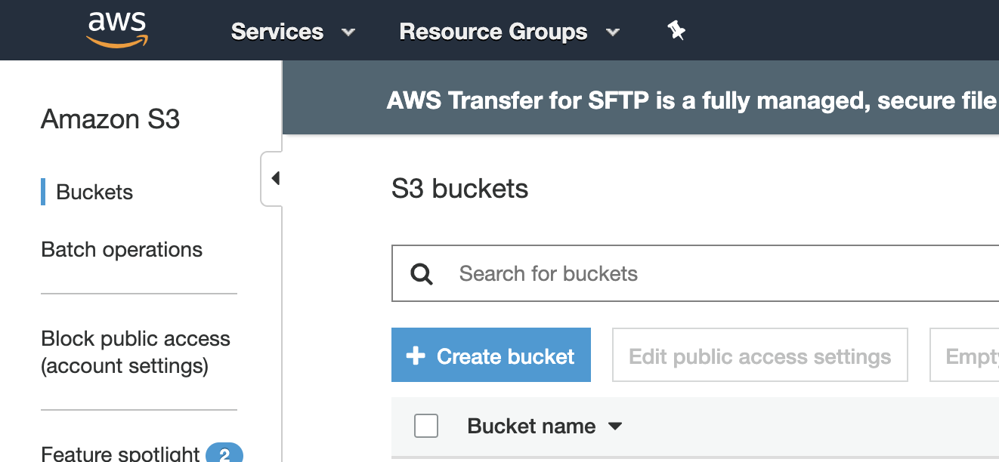

3. Give your container a descriptive name and hit `Next`:

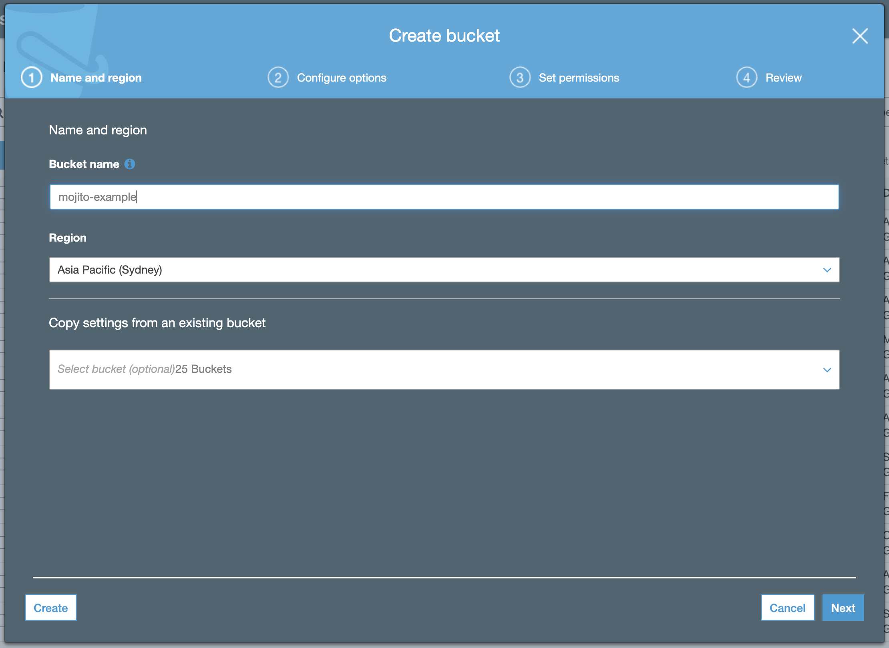

4. Keep the default options (versioning is useless when Mojito JS is source-controlled):

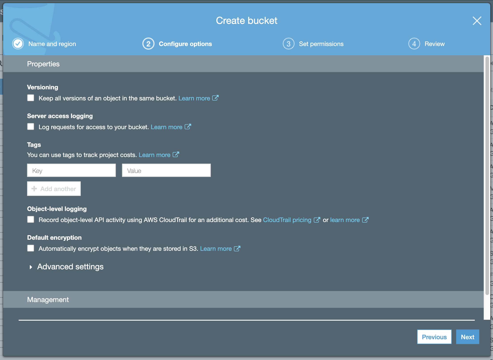

5. Disable blocking of public access. Again, this simplifies permissions and your bucket contents will be available through Cloudfront anyway.


6. Review your settings and hit `Create bucket`:

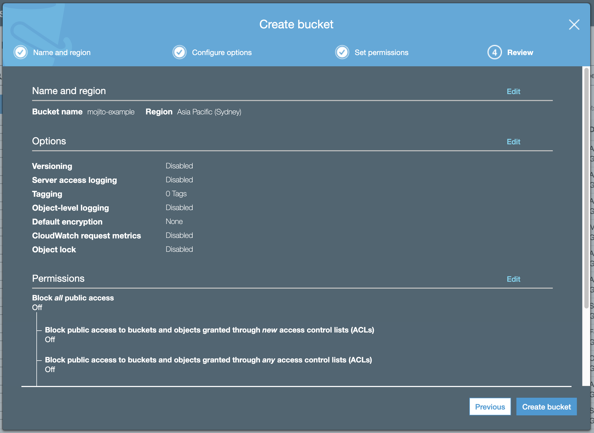


## Add folders for your Mojito JS environments

We suggest creating folders for development and production use:

 - `js` (production)
 - `jsdev` (development)

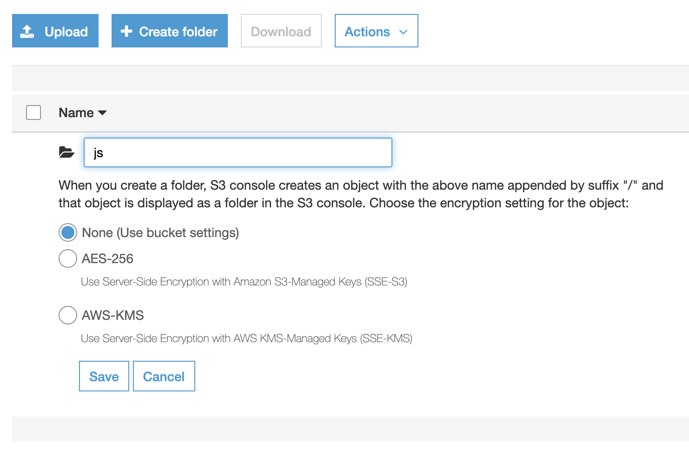
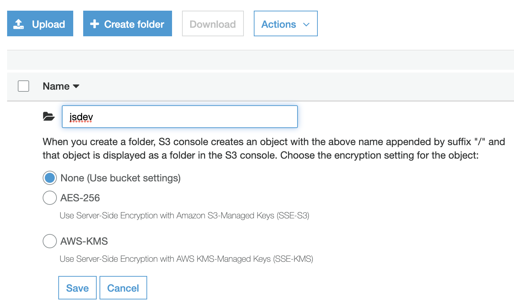

You'll need to add these keys to your Mojito JS [`repo/config.js`](../../config.js) file, like so:

```js
module.exports = {
	containerName: "containerfilename",
	s3BucketDev: "mojito-example/jsdev",
	s3BucketPRD: "mojito-example/js",
	s3Region: "ap-southeast-2"
};
```

Read more [about the Gulp file's config script](./build-script.md).


## Create a Cloudfront distribution from your S3 bucket

Now we'll setup a CDN to serve your container lightning-quick from anywhere in the world.

1. [Open your Cloudfront console in AWS](https://console.aws.amazon.com/cloudfront/home) and hit the big blue `Create Distribution` button.

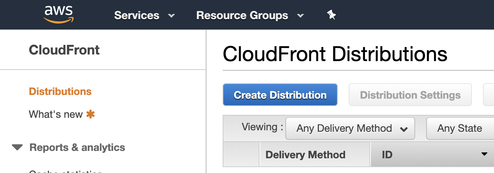

2. Hit `Get Started` under the "Web" delivery method:


3. Using your newly created S3 bucket, point the `Origin Domain Name` at the S3 bucket (in this case, `mojito-example`):

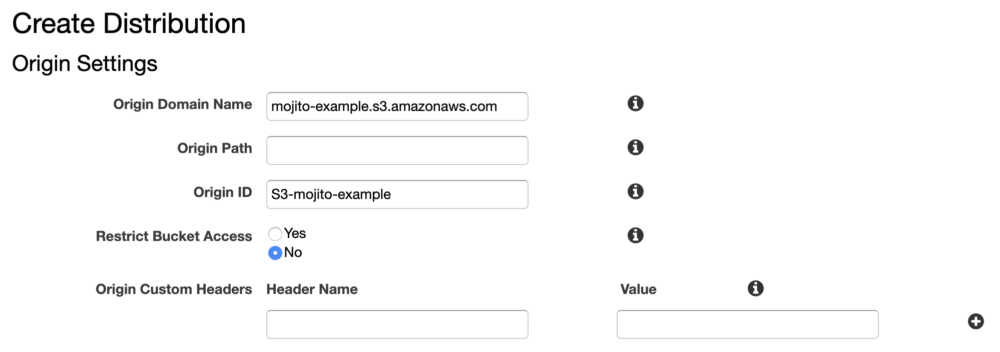

4. Most of the default settings should be fine to keep over the rest of the pages.

**NB:** You may be tempted to set TTL headers or compression, but it's important to ensure:

 - `Use Origin Cache Headers` is enabled
 - `Compress objects automatically` is set to diabled

We make these options configurable inside the gulp publishing script, instead.

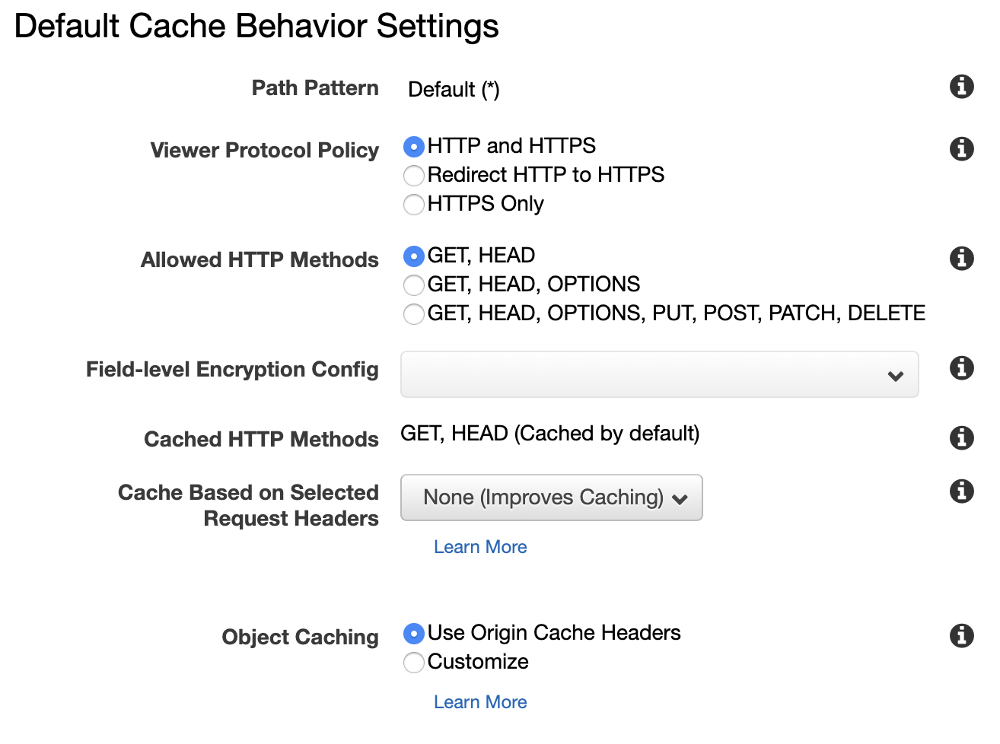

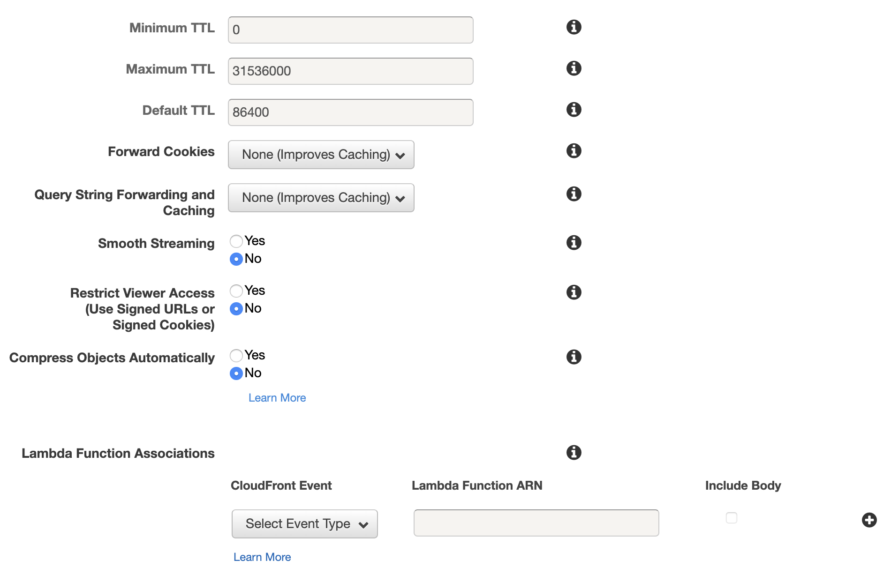

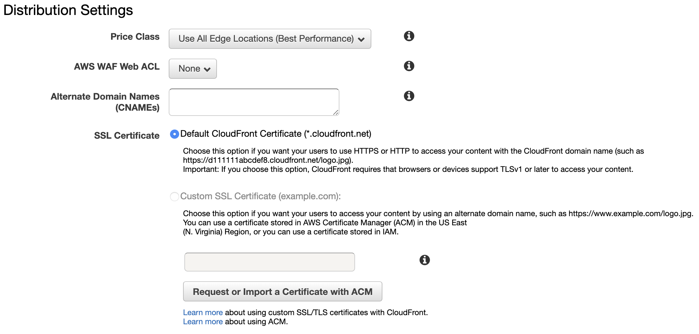

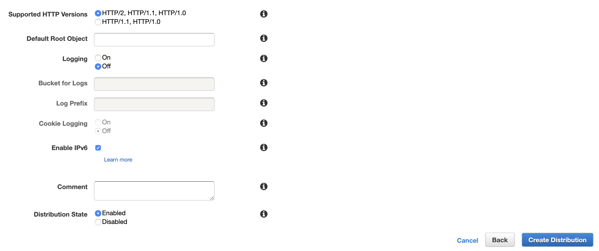

5. Once your settings match the recommended settings above, hit `Create Distribution` to continue. Your Cloudfront distribution will provision shortly...

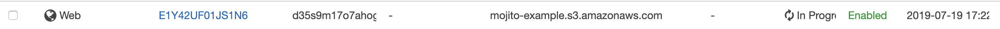

... and it'll give you an address to access objects over.

### Now may be a good time to test S3/Cloudfront

Add a file (with Public read-access enabled) to the root of the S3 container directory and try accessing it through the new Cloudfront domain you provisioned:

```
https://{{my distribution hostname}}.cloudfront.net/test.file
```

Check to see that it loads. If so, nice job!

## Next steps

Now you're set up with hosting, you need a user with permission to publish to S3.

Next, [create a publisher/user in Amazon IAM to publish your container into your environments](./iam.md).
